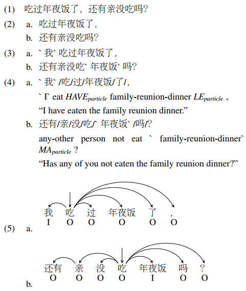

# An Ellipsis-aware Chinese Dependency Treebank for Web Text

Web 2.0 has brought with it numerous user-produced data revealing one's thoughts, experiences, and knowledge, which are a great source for many tasks, such as information extraction, and knowledge base construction. However, the colloquial nature of the texts poses new challenges for current natural language processing techniques, which are more adapt to the formal form of the language. Ellipsis is a common linguistic phenomenon that some words are left out as they are understood from the context, especially in oral utterance, hindering the improvement of dependency parsing, which is of great importance for tasks relied on the meaning of the sentence. In order to promote research in this area, we are releasing a Chinese dependency treebank of 319 weibos, containing 572 sentences with omissions restored and contexts reserved.

The detailed description of the treebank and the annotation procedure is at [arxiv(not passed yet)]. An example of the annotation procedure is shown below

# Statistics of the Treebank

| Type          | #Token | #Word | #Sentence | #Weibo |
| ------------- | -------: | ------: | ----------: | -------: |
| Original      |   12,508 |   8,382 |         572 |      319 |
| Ellipsis      |      256 |     208 |         162 |      122 |
| Overall       |   12,764 |   8,590 |         572 |      319 |
| Percentage(%) |     2.01 |    2.42 |       28.32 |    38.24 |

We are releasing a first version of the dataset, containing 8,590 tokens, 572 sentences, and 319 weibos (Table 1). The raw text is from [LWC](http://lwc.daanvanesch.nl/), a weibo corpus. Unsurprisingly, due to the characteristics of microblogging, the average length of the sentences are quite short, around 15.0 tokens per sentence, comparing to 27.0 tokens per sentence in CTB5. We have restored 256 characters and 208 words in the dataset. As shown in the table above, ellipsis is indeed a common phenomenon in web text, which requires more attention, as 162 of the sentences, and 122 of the weibos contain ellipsis, meaning 38.24% of the weibos involve ellipsis.

There are total 8,018 dependencies (excluding the root). 7,762 of them are from an original token to an original token, 187 of them are from an original token to an omitted token, 61 of them are from an omitted token to an original token, and 8 of them are from an omitted token to an omitted token. 

# Annotation Format

The annotation files are converted to a single file in the tsv format. There are four columns in the file. 
- The first column is the token’s index in the sentence, starting from 1. 
- The second column is the textual form of the token. 
- The third column indicates whether the token is a restored one. ’O’ stands for original tokens, and ’I’ stands for restored tokens. 
- The fourth column is the head of the token. 0 indicates the token is the root. 

There is an empty line between sentences, and an extra empty line between weibos.
